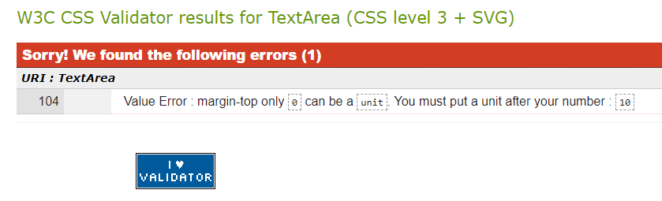

# CuisinePlus

## Introduction

**CuisinePlus** is online restaurant reservation platform for diners. The goal of the application is to aggregate and showcase restaurants in Ireland. Users are able to find a restaurant they love from the featured restaurants across Ireland and make reservations at their chosen restaurants. Also, signed in users should be able to leave a review, read reviews left by other users, and like a restaurant. 

The site is built in Django using Python, JavaScript, CSS, and HTML. It provides full CRUD functionality reservations: users can create, read, update, and delete their bookings. 


[View Live Project Here](https://cuisine-plus.herokuapp.com/)

**Please Note:** the needs within this project are for illustrative and educational purpose.

## Table of Contents

[Introduction](#introduction)

[User Experience](#user-experience)

* [Epics](#epics-and-user-stories)
* [Kanban Board](#kanban-board)
* [Design](#design)
* [Color Scheme](#color-scheme)
* [Wireframes](#wireframes)
  
[Features](#features)

[Information Architecture](#information-architecture)

[Database Schema](#database-schema)

[Technology Stack](#tech-stack)

* [Languages Used](#languages-used)
* [Python Libraries](#python-libraries)
* [VSCode Extensions Used](#vscode-extensions-used)

[Testing](#testing)

* [PEP8 Testing](#pep8-testing)
* [Validator Testing](#validator-testing)
* [Accessibility Testing](#accessibility-testing)

[Clone](#clone)
[Credits](#credits)
[Acknowledgements](#acknowledgements)

## User Experience 

### EPICS and USER STORIES

### EPIC: Sign In feature #1

#### USER STORY: Account Sign in #7

* As a a registered user I want to sign in using my username and preferred password so that I can search for a restaurant and make a booking.

    **Acceptance Criteria 1:**\
    **Given** that I’m a registered user\
    and I’m on the Sign-In page\
    **When** I enter my Username and Password\
    and I click the Sign-In button\
    **Then** I am logged in to my account so that I can access my personal account information and I can search for a restaurant and book a table.

    **Acceptance Criteria 2:**\
    **Given** that I’m a registered user\
    and I’m on the Sign-In page\
    **When** I click the Sign-In button\
    and I am logged in to my account\
    **Then** I can see a displayed message that I have successfully signed in .

- [x] Task 1 – Create a link to a Sign-In page
- [x] Task 2 - Create a Sign-In form for registered users to enter their login details
- [x] Task 3 - Implement a functionality to show a successfully signed in message.

#### USER STORY: Remember me checkbox #10

* As a a registered user I can check a remember me checkbox before I sign in so that I can always have automatic access to my account from the same system until I manually sign out.

* Acceptance Criteria
  
    **Given** that I’m a registered user\
    and I’m on the Sign-In page\
    **When** I enter my login details and check “Remember Me” checkbox\
    and I click the Sign-In button\
    **Then** I am logged in and I can always have automatic access to my account from the same system until I manually sign out

- [x] Task – Implement a “remember me” functionality on login page.

#### USER STORY: Account Social Sign in #8

* As a a registered user I want to sign in into my account using social network so that I have a convenient alternative to login into my account.

    **Acceptance Criteria 1:**\
    **Given** that I’m a new user\
    **When** I’m on the Sign-in page with a social Login (Facebook, Google, Apple)\ 
    **Then** I can sign in using my existing social account IDs so that I can access the application.

    **Acceptance Criteria 2:**\
    **Given** that I’m a registered user\
    **When** I click my preferred social media account\
    **Then** I am logged in using my existing social account IDs so that I can access my personal account information.

- [ ] Task 1 - Create a social Sign-in feature for users to login with their social media accounts
- [ ] Task 2 - Create a method to redirect the new user to the home page on successful registration.

### EPIC: Sign Up #2

#### USER STORY: Account Sign up #26

* As a new user I can register by creating a username and password so that I have access to featured restaurants and menus.

    **Acceptance Criteria 1**\
    **Given** that I’m a new user\
    and I’m on the Sign-Up page\
    **When** I enter mandatory registration information (Username, Password)\
    and I click the Sign-Up button\
    **Then** I can see a confirmation message that an account has been created for me successfully

    **Acceptance Criteria 2:**\
    **Given** that I’m a user\
    and I’m on the Sign-Up page\
    **When** I enter Username that already exists and a Password\
    and I click the Sign-Up button\
    **Then** I am not registered and I can see an error message that a user with that username already exists.

- [x] Task 1 – Modify the AllAuth accounts templates 
- [x] Task 2 - Create a link to a Sign-Up page 
- [x] Task 3 - Use allauth authentication system to validate the user registration data and to prevent multiple accounts creation with same username.
- [x] Task 4 - Create a method to redirect the new user to the home page on successful registration.
- [ ] 

#### USER STORY: Account Social Sign up #27

* As a new user I can sign up using a social network provider so that I can access the application using my existing social account IDs.

    **Acceptance Criteria**\
    **Given** that I’m a new user\
    and I’m on the Sign-Up page with a social Login(Facebook, Google, Apple)\
    **When** I click my preferred social media account\ 
    **Then** I can sign up using my existing social account IDs so that I can access the application.

- [ ] Task 1 - Create a social Sign-Up feature for users to register with their social media accounts

### EPIC: Bookings #5

#### USER STORY: Make a Booking #12

* As a user I want to make a booking so that I can dine in my preferred restaurant.

    **Acceptance Criteria**\
    **Given** that I’m a logged in user\
    **When** I am on a given restaurant page\
    **Then** I can see a form to book the restaurant  

- [x] Task 1 - Create a booking form on a restaurant page
- [ ] Task 2 - Implement a functionality to validate Number of guests and Date fields

#### USER STORY: View my Booking #13

* As a **User** I want to **view my booking** so that **I can be sure my booking information is correct**

    **Acceptance Criteria**\
    **Given** that I’m a logged in user\
    and I have booked a restaurant\
    **When** I see Manage Booking menu on My Account dropdown\ 
    **Then** I can click the Manage My Booking to view my booking.

    - [x] Task 1 -  Create Manage Booking menu on My Account dropdown 
    - [x] Task 2 - Implement functionality for users to view their booking
  
#### USER STORY: Manage my Booking #14

* As a User I want to edit my booking so that I can update my booking information such as date, time, and number of guests.

    **Acceptance Criteria 1**\
    **Given** that I’m a logged in user\
    and I’m on my account page\ 
    **When** I see Manage Booking menu on My Account dropdown \
    **Then** I can click Manage My Booking to edit or delete my booking.

    **Acceptance Criteria 2**\
    **Given** that I’m a logged in user\
    and I’m on Manage Booking page\ 
    **When** I click the edit button\ 
    **Then** I can edit my booking and save changes successfully.

    **Acceptance Criteria 3**/
    **Given** that I’m a logged in user/
    and I’m on Manage Booking page/  
    **When** I click the delete button/ 
    and, I click to confirm the deletion request/
    **Then** I can delete the booking and redirected to homepage.

- [x] Task 1 - Implement a method for users to edit their booking 
- [x] Task 2 – Implement a method for users to delete their booking
- [x] Task 3 – Create a confirmation form for user to effectively delete booking. 

### EPIC: Reviews and Ratings #6

#### USER STORY: Review a restaurant #30

* As a logged in user I want to leave a review so that I can provide my honest comment based on my experience with the restaurant and their cuisine.

    **Acceptance Criteria 1**\
    **Given** that I’m a logged in User\
    **When** I am impressed with a restaurant and their meal\
    **Then** I can leave a review for the restaurant as a feedback.

    **Acceptance Criteria 2**\
    **Given** that I’m a logged in User\
    **When** I leave a review for the restaurant\ 
    **Then** I can see and read the reviews left by others.

- [x] Task 1 – Create a functionality to display reviews to all users.
- [x] Task 2 – Create a functionality that lets logged in users write a review.

#### USER STORY: Rate a restaurant #28

* As a logged in user I can rate a restaurant so that I can leave my impression of the food.

    **Acceptance Criteria 1**\
    **Given** that I’m a logged in User\
    **When** I am impressed with a restaurant and their meal\
    **Then** I can see a like button and click to Like the restaurant as a positive feedback.

    **Acceptance Criteria 2**\
    **Given** that I’m a logged in User\
    **When** I Like the restaurant as a positive feedback\
    **Then** I can see the number of likes for the restaurant increased by one like.

- [x] Task 1 – Create a functionality that allows users to rate a restaurant by liking it.
- [x] Task 2 – Develop a counter for number of a restaurant Likes.

#### USER STORY: View Ratings by Others #29

* As a logged in user I can view ratings left by others so that I can choose the meal that is best for me.

  **Acceptance Criterion**\
  **Given** that I’m a User\
  **When** I am on the site's homepage\ 
  **Then** I can see the ratings left by others by the number of Likes for the restaurants.

- [x] Task 1 – Create a functionality that shows restaurants rating by the number of their likes.
  
### EPIC: User Profile #3

#### USER STORY: Change my password #23

* As a logged in user I want to update my password regularly so that I can prevent my account access if it was compromised.

#### USER STORY: Forgot password #9

* As a logged in user I want to reset my password so that if I forget it I can create a new password.

    **Acceptance Criteria**\
    **Given** that I’m a registered user\
    and I’m on the Sign-In page\
    **When** I click the “Forgot Password?” link\
    **Then** I can reset my password if I’ve forgotten it or I want to update it for security reasons.

- [ ] Task – Implement a method to reset password on login page.

### EPIC: Search Restaurant and Cuisine #4

#### USER STORY: Search by Restaurant #16

* As a User I want to view a list of Restaurants in my search so that I can select one to book a table in.

    **Acceptance Criteria**\
    **Given** that I’m a User\
    **When** I can see the search bar at the top of the page in a visually distinguishable way\
    **Then** I can search for restaurant by typing the name in the search bar

- [ ] Task 1 - Implement search bar functionality that is visible to the user on every page
- [ ] Task 2 – Implement a method for user to Search for a restaurant by name

* #### USER STORY: Search by Cuisine #17

* As a User I want to search for meal so that I can find the restaurant that offers a country’s meal of my choice.

    **Acceptance Criteria**\
    **Given** that I’m a logged in User\
    and I can see the search bar at the top of the\ page in a visually distinguishable way\
    **When** I search for meal by typing the meal name in the search bar\
    **Then** I can find the restaurant that offers a country’s meal of my choice

- [ ] Task 1 - Implement search bar functionality that is visible to the user on every page
- [ ] Task 2 – Implement a method for user to Search for a restaurant by meal

#### USER STORY: Search by City #18

* As a User I want to search location so that I can find the restaurant near me.

    **Acceptance Criteria**\
    **Given** that I’m a logged in User\
    and I can see the search bar at the top of the page in a visually distinguishable way\
    **When** I search by typing location in the search bar\
    **Then** I can find the restaurant near me in my city

- [ ] Task 1 - Implement search bar functionality that is visible to the user on every page
- [ ] Task 2 – Implement a method for user to Search a restaurant by location

#### USER STORY: Search by Date and Time #19

* As a User I want to search a date/time frame so that I can book a restaurant based on my preferred date and time.

    **Acceptance Criteria**\
    **Given** that I’m a logged in User\
    **When** I see a date/time select box\  
    **Then** I can book restaurant based on my preferred date and time

- [ ] Task 1 - Implement search bar functionality with a date/time select box visible to the user on every page
- [ ] Task 2 – Implement a method for user to sort restaurants by date and time

### Kanban Board


### Design

#### Typography

* [Roboto](https://fonts.google.com/specimen/Roboto)
* Sans-serif

The main font used for the website is [Roboto](https://fonts.google.com/specimen/Roboto) with sans-serif as the fallback. Friendly and straightforward in appearance, Roboto is a “neo-grotesque” sans-serif typeface family. To keep things simple and clean, Roboto is the only font used throughout the website, but with font weights of bold 700 for headings and lower headings and thin 100 for body text. The beauty of Roboto is that it is modern, contemporary, minimalistic, readable, and serves well for an e-commerce website.

#### Color Scheme

The colors used are Green (#00FF00), Red (#E84610), Blue (#0275d8), White (#ffffff), and Black (#000000).

| Color             | Hex                                                                |
| ----------------- | ------------------------------------------------------------------ |
| Green Color |  #4b7c20 |
| Red Color |  #E84610 |
| Blue Color |  #0275d8 |
| White Color |  #ffffff |
| Black Color |  #000000 |
|

The Black and white are default colours, used as the site’s as core building blocks. **CuisinePlus** is a representation of food and hospitality industry so the Green and Blue colours are used to visually communicate nourishment and the feeling of human emotions. The red colour represents warmth and passion; the heart icon changes from black to red colour when a user likes a restaurant. These five colours in combination express the aesthetic beauty that shapes the site's form and function in order to please and delight the site’s visitors.


The color values were then checked for accessible contrast using [EightShapes’](https://contrast-grid.eightshapes.com/)’ color contrast grid tool to ensure they meet [WCAG 2.0 criteria](https://www.w3.org/TR/UNDERSTANDING-WCAG20/visual-audio-contrast-contrast.html).

#### Wireframes

The wireframe was created using [Balsamiq](https://balsamiq.com/). And it was designed for desktop only.


## Features

## Home Page

### Header

The header has the logo and navigation menus arranged in order of priority of information and features.

#### Logo & Title


The logo is a Font Awesome bow of rice icon, a symbolic representation of sustenance and abundance, a symbol of nourishment of the physical body and well-being. The logo and title have an implicit link to the homepage, following a long-standing web convention and for fluid user experience.

#### Navigation Menus

Navbar - Users View             |        Navbar - Logged In Users View
:-------------------------:|:-------------------------:
  |  

The navigation menus, for anonymous users Home, Bookings, Sign Up, and Login. And for the logged in users, only Home and My Account menus are visible to logged in users. And My Account drop-down has Manage Bookings and Logout menus.

This Full responsive header is fixed and consistent across in all pages of the website to allow for easy navigation and without the user having to rely on the browser’s “forward” and “back” arrows as navigation substitutes.

### Homepage Main Section


The main section is split into three areas: the background image that displays an image of a dinning environment, How CuisinePlus works section that sums up the three critical processes of choosing the restaurant of your choice, book the restaurant, and arrive the restaurant at the expected date and time to have your meal. The third second is the Featured Restaurants that has only eight restaurants on display.

The main section introduces the user/customer to the relevant sections of the site, and takes a progressive disclosure approach by revealing to the user that CuisinePlus is an online restaurant reservation platform for diners, and more importantly, encourages them to go further beyond the homepage to create fluid user experience.

### Individual Restaurant Page


All users can view the list of restaurants on display, but only registered logged in users have access to the full detail of each restaurant. When non-registered or non-logged in users click on any of the displayed restaurant, they are taking to the sign in page to log in first.

And when logged in users click on any of the displayed restaurant, they are taken to the individual restaurant page of that specific product to continue with their purchase.

The Individual Restaurant Page has an image of either one of the restaurant’s menus or the building itself and summary of restaurant name, cuisine types, like icon (with a counter, if the restaurant has been liked by a happy customer. A liked icon is highlighted in red colour and a yet-to-liked icon is black) and a review icon. 

In broader terms, the individual restaurant page has has three broad sections: Overview, Reviews, and Menus sections:

#### Overview


The overview section that shows the restaurant information such as about the restaurant, address, open hours, Cuisines, phone number, and a booking form for users to make a booking.

#### Review


The Reviews section is divided into two sections. The first section shows customers’ reviews and the second section contains a form to leave a review about the restaurant.

#### Restaurant Menu


The Menus section holds the menu image and menu description.

### My Account page

A registered logged in user can manage his booking by clicking on the **Manage Bookings** menu on **My Account** drop-down. This page holds only the list of reservation made by the user.

#### Your Reservations


The reservation contains the information about the reservation. There is edit and delete button should the user wants to change their booking information or to delete their booking.

#### Edit Your Booking


When the users click on the edit button, it opens the edit form that contains the user’s booking information such as name, number of guests, booking date and time, and any additional information entered by the user when making the reservation. The user can then make changes and click the “Save Changes” button to update the information. But should the users no longer wants to make any changes to their button, they can click the “Cancel” button and go back to Your Reservations page.

#### Delete Your Booking


Users may choose to delete the booking completely. Should that be the case, the user will have to click the delete button.

A deletion requires a second level for confirmation for deletion to take effect. So, when the logged users click on the delete button, it opens the confirmation form with a warning that deleting the booking will also delete related items. To go ahead, the user has to click the “Yes, I’m sure” button. And should the users change their mind, they have to click the “No, take me back” button to return to the Your Reservations page.

The process from navigation menus to bookings deletion, as progressive action of the user, is graphically represented in the information architecture and database scheme below.

## Information Architecture


## Database Schema


## Tech Stack

### Languages Used

* [Python](https://www.python.org/)
* [HTML5](https://developer.mozilla.org/en-US/docs/Glossary/HTML5)
* [CSS3](https://developer.mozilla.org/en-US/docs/Web/CSS)
* [JavaScript](https://www.javascript.com/)

#### Python Libraries

* [Django](https://www.djangoproject.com/)
* [Gunicorn](https://gunicorn.org/)
* [Cloudinary](https://cloudinary.com/)
* [Dj3-Cloudinary-storage](https://pypi.org/project/dj3-cloudinary-storage/)
* [Dj-database-url](https://pypi.org/project/dj-database-url/)
* [Psycopg2](https://pypi.org/project/psycopg2/)
* [Pylint-Django](https://pypi.org/project/pylint-django/)
* [Pep8](https://peps.python.org/pep-0008/)
* [Heroku](https://dashboard.heroku.com/)
* [django-multiselectfield](https://pypi.org/project/django-multiselectfield/)
* [Django Crispy Forms](https://django-crispy-forms.readthedocs.io/en/latest/)
* [Summernote](https://summernote.org/)

#### VSCode Extensions Used

* [Jinja template language support for VSCode](https://marketplace.visualstudio.com/items?itemName=wholroyd.jinja).
* [Markdown lint](https://marketplace.visualstudio.com/items?itemName=DavidAnson.vscode-markdownlint) - used For style checking and to maintaining standard.
* [Pylance](https://marketplace.visualstudio.com/items?itemName=ms-python.vscode-pylance) – a language support for python for writing a better code.
* [Code Spell Checker](https://marketplace.visualstudio.com/items?itemName=streetsidesoftware.code-spell-checker) – a language support for python for writing a better code.

## Testing

### PEP8 Testing

* [PEP8 online](http://pep8online.com/) was used to check the code for PEP8 requirements.

### Accessibility Testing

[Accessibility Insights](https://accessibilityinsights.io/) was used to check and fix accessibility issues.

* It found one issue of aria-hidden focus on homepage.

**Fixed bug:**
The accessibility issue was as a result of not closing the target=“_blank” for Twitter and Instagram icons on footer. I had to close it to fix the issue and add other accessibility requirements for links that open to external websites.

### Chrome's Lighthouse

[Chrome's Lighthouse](https://developers.google.com/web/tools/lighthouse) - used to test accessibility.
  
### W3C CSS Validator testing

[W3C CSS Validator](https://jigsaw.w3.org/css-validator/) found error in menu-image class, which has no unit after 10 in margin-top.



```
.menu-image{
    aspect-ratio:3/1;
    margin-top: 10;
    min-width: 100%;
    height: 30vh;
}
```

**Fixed bug:**

Fixed the issue by adding rem unit: **margin-top: 0.6rem;**

## Clone

* Clone from GitHub to VSCode:
    1. Log in to [GitHub](https://github.com/panzek/portfolio3-mortgage-advisor)
    2. Click on the code button beside the green gitpod button. 
    3. Copy the link and go to VSCode
    4. Press F1 to display the command palette. 
    5. Enter gitcl, select the Git: Clone command, press Enter
    6. When prompted for the Repository URL, enter the copied GitHub repository url, then press Enter. 
    7. Select (or create) the local directory into which you want to clone the project.
    8. Repository is now ready for development

* Environment Variable:
    1. Create virtual environment in the project folder - d:\workspaces>python –m venv my_project\venv 
    2. Activate the virtual environment - d:\workspaces>my_project\venv\Scripts\activate.ps1 
    3. cd into new project folder - d:\workspaces>cd my_project
    4. To open in VSCode - d:\workspaces\my_project>code. 
    5. Open VSCode and Press CONTROL+SHIFT+P, type‘Python Interpreter’ and select it.
    6. Either select the venv environment from the list or click ‘Enter interpreter path’ and navigate to the venv folder, and proceed into Scripts and select python.exe 
    7. venv\Scripts\python.exe


## Credits

* [Code Institute](https://codeinstitute.net/) lectures and “Hello Django” and "Django Blog" walkthrough projects shaped and firmed the ideas and techniques that frame this Portfolio Project 4 for Diploma the [Full Stack Software Development](https://codeinstitute.net/ie/full-stack-software-development-diploma/).
* I drew inspiration for the structural makeup of the site from [DineSurf](https://app.dinesurf.com/dashboard).  
* [Mark Down Guide](https://www.markdownguide.org/basic-syntax/)  
* [Bootstrap](https://getbootstrap.com/)
* [Django documentation](https://docs.djangoproject.com/) -
* [Customizing Form Fields, Widgets, Placeholders, & CSS - Python & Django](https://www.youtube.com/watch?v=quJzUzCs6Q0) - quite a helpful video on how to customize Form Fields, Widgets, and Placeholders in Django.
* [Tinypng.com](https://tinypng.com/) – used to reduce the file size.
* [Stackoverflow](https://stackoverflow.com/), always an important resource for answers to almost all knotty coding issues. 
  
## Acknowledgements

I am eternally grateful for your care, love, help, and support:
  
- [Andrew Dempsey](https://github.com/andrewdempsey2018);
- [Akshat Garg](https://github.com/akshatnitd) and Jubril Akolade, my [Code Institute](https://github.com/Code-Institute-Org) mentors;
- [Code Institute](https://github.com/Code-Institute-Org) tutors: Ed, Gemma, John, and Scott;   
- Rachel and the [Code Institute](https://github.com/Code-Institute-Org) Student care team.
