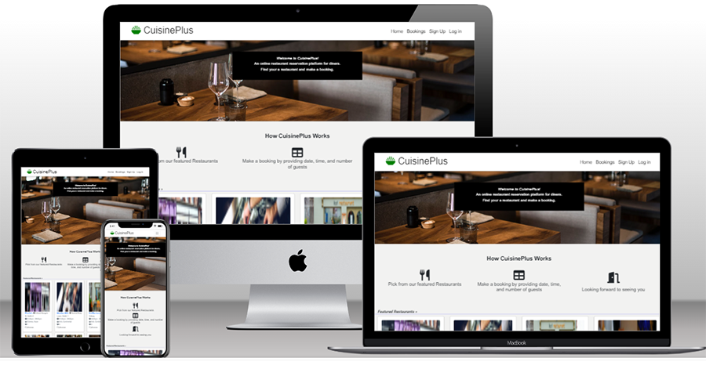
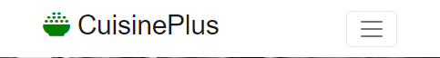

# CuisinePlus

* **Introduction**

**CuisinePlus** is online restaurant reservation platform for diners. The goal of the application is to aggregate and showcase restaurants in Ireland. Users are able to find a restaurant they love from the featured restaurants across Ireland and make reservations at their chosen restaurants. Also, signed in users should be able to leave a review, read reviews left by other users, and like a restaurant. 

The site is built in Django using Python, JavaScript, CSS, and HTML. It provides full CRUD functionality reservations: users can create, read, update, and delete their bookings. 

[View Live Project Here](https://cuisine-plus.herokuapp.com/)

**Please Note:** the needs within this project are for illustrative and educational purpose. 

## Table of Contents

1. [User Experience](#user-experience)
    * [Epics](#epics-and-user-stories)
    * [Design](#design)
    * [Color Scheme](#color-scheme)
    * [Wireframes](#wireframes)
  

2. [Features](#features)

3. [Technology Stack](#tech-stack)
    * [Languages Used](#languages-used)
    * [Python Libraries](#python-libraries)
    * [VSCode Extensions Used](#vscode-extensions-used)

4. [Testing](#testing)
    * [PEP8 Testing](#pep8-testing)
    * [Validator Testing](#validator-testing)
    * [Accessibility Testing](#accessibility-testing)

5. [Clone](#clone)
6. [Credits](#credits)
    * [Acknowledgements](#acknowledgements)

## User Experience 

### EPICS and USER STORIES

### EPIC: Sign In feature #1

#### USER STORY: Sign in with username and password #7

* As a a registered user I want to sign in using my username and preferred password so that I can search for a restaurant and make a booking.

#### USER STORY: Remember me checkbox #10

* As a a registered user I can check a remember me checkbox before I sign in so that I can always have automatic access to my account from the same system until I manually sign out.

#### User Stories planned for next sprint

#### USER STORY: Sign in with Social Networks #8

* As a a registered user I want to sign in into my account using social network so that I have a convenient alternative to login into my account.

### EPIC: Sign Up #2

#### USER STORY: Sign up by creating a username and password #26

* As a new user I can register by creating a username and password so that I have access to featured restaurants and menus.

### EPIC: Bookings #5

#### USER STORY: Make a Booking #12

* As a user I want to make a booking so that I can dine in my preferred restaurant.

#### USER STORY: View my Booking #13

* View my Booking#13.

#### USER STORY: Manage my Booking #14

* As a User I want to edit my booking so that I can update my booking information such as date, time, and number of guests.

#### USER STORY: Cancel my Booking #15

* As a User I want to cancel my booking so that I can leave the date for others to use.

### EPIC: Reviews and Ratings #6

#### USER STORY: Write a review on a restaurant #30

* As a logged in user I want to leave a review so that I can provide my honest comment based on my experience with the restaurant and their cuisine.

#### USER STORY: Like and Unlike restaurant #31

* As a logged in user I want to see a like or dislike button so that I can click to like or dislike the restaurant and their cuisine.

### EPICS and User Stories planned for next sprint

#### USER STORY: Rate a restaurant #28

* As a logged in user I can rate a restaurant so that I can leave my impression of the food.

#### USER STORY: View Ratings by Others #29

* As a logged in user I can view ratings left by others so that I can choose the meal that is best for me.

#### USER STORY: Make a recommendation #32

* As a logged in user I can rate a restaurant so that I can leave my impression of the food.As a logged in user I want to recommend a restaurant so that I can provide a the name of a good restaurant that is not listed on the site.

  
### EPIC: User Profile #3

#### USER STORY: Read personal information #20

* As a logged in user I want to view my profile so that I can be sure my personal information is correct and up-to-date.

#### USER STORY: Update personal information #21

* As a logged in user I want to edit my profile so that I can update my personal information.

#### USER STORY: Add profile image #22

* As a logged in user I want to upload my photo so that my profile will have my image.

#### USER STORY: Change my password #23

* As a logged in user I want to update my password regularly so that I can prevent my account access if it was compromised.

#### USER STORY: Reset my password #24

* As a logged in user I want to reset my password so that if I forget my password I can create a new password.

#### USER STORY: Delete my Account #25

* As a logged in user I can delete my account so that I can close my account with personal information.

#### USER STORY: Social Sign up #27

* As a new user I can sign up using a social network provider so that I can access the application using my existing social account IDs.

### EPIC: Search Restaurant and Cuisine #4

#### USER STORY: Search by Restaurant #16

* As a User I want to view a list of Restaurants in my search so that I can select one to book a table in.

* #### USER STORY: Search by Cuisine #17

* As a User I want to search for meal so that I can find the restaurant that offers a country’s meal of my choice.

#### USER STORY: Search by City #18

* As a User I want to search location so that I can find the restaurant near me.

#### USER STORY: Search by Date and Time #19

* As a User I want to search a date/time frame so that I can book a restaurant based on my preferred date and time.

#### USER STORY: View a location map #33

* As a logged in user I want to see a Google map so that I can get a quick direction to the restaurant's location.

### Design

* Color Scheme
  * The colors used are Green, Blue, White, and Black.

| Color             | Hex                                                                |
| ----------------- | ------------------------------------------------------------------ |
| Green Color |  #00FF00 |
| Blue Color |  #0275d8 |
| White Color |  #ffffff |
| Black Color |  #000000 |

* Wireframes
  * The wireframe was created using [Balsamiq](https://balsamiq.com/). And it was designed for desktop only.

    

    

    

    

    

    

    

    

    

## Features

## Tech Stack

* Languages Used
  * [Python](https://www.python.org/)
  * [HTML5](https://developer.mozilla.org/en-US/docs/Glossary/HTML5)
  * [CSS3](https://developer.mozilla.org/en-US/docs/Web/CSS)
  * [JavaScript](https://www.javascript.com/)

* **Python Libraries**
  * [Django](https://www.djangoproject.com/)
  * [Gunicorn](https://gunicorn.org/)
  * [Cloudinary](https://cloudinary.com/)
  * [Dj3-Cloudinary-storage](https://pypi.org/project/dj3-cloudinary-storage/)
  * [Dj-database-url](https://pypi.org/project/dj-database-url/)
  * [Psycopg2](https://pypi.org/project/psycopg2/)
  * [Pylint-Django](https://pypi.org/project/pylint-django/)
  * [Pep8](https://peps.python.org/pep-0008/)
  * [Heroku](https://dashboard.heroku.com/)
  * [django-multiselectfield](https://pypi.org/project/django-multiselectfield/)
  * [Django Crispy Forms](https://django-crispy-forms.readthedocs.io/en/latest/)
  * [Summernote](https://summernote.org/)

* **VSCode Extensions Used**
  * [Jinja template language support for VSCode](https://marketplace.visualstudio.com/items?itemName=wholroyd.jinja).
  * [Markdown lint](https://marketplace.visualstudio.com/items?itemName=DavidAnson.vscode-markdownlint) - used For style checking and to maintaining standard.
  * [Pylance](https://marketplace.visualstudio.com/items?itemName=ms-python.vscode-pylance) – a language support for python for writing a better code.
  * [Code Spell Checker](https://marketplace.visualstudio.com/items?itemName=streetsidesoftware.code-spell-checker) – a language support for python for writing a better code.

## Testing

* PEP8 Testing
  * [PEP8 online](http://pep8online.com/) was used to check the code for PEP8 requirements.

* Accessibility Testing
  * [Accessibility Insights](https://accessibilityinsights.io/) was used to check and fix accessibility issues.
  * [Chrome's Lighthouse](https://developers.google.com/web/tools/lighthouse) - used to test accessibility.
  

## Clone

* Clone from GitHub to VSCode:
    1. Log in to [GitHub](https://github.com/panzek/portfolio3-mortgage-advisor)
    2. Click on the code button beside the green gitpod button. 
    3. Copy the link and go to VSCode
    4. Press F1 to display the command palette. 
    5. Enter gitcl, select the Git: Clone command, press Enter
    6. When prompted for the Repository URL, enter the copied GitHub repository url, then press Enter. 
    7. Select (or create) the local directory into which you want to clone the project.
    8. Repository is now ready for development

* Environment Variable:
    1. Create virtual environment in the project folder - d:\workspaces>python –m venv my_project\venv 
    2. Activate the virtual environment - d:\workspaces>my_project\venv\Scripts\activate.ps1 
    3. cd into new project folder - d:\workspaces>cd my_project
    4. To open in VSCode - d:\workspaces\my_project>code. 
    5. Open VSCode and Press CONTROL+SHIFT+P, type‘Python Interpreter’ and select it.
    6. Either select the venv environment from the list or click ‘Enter interpreter path’ and navigate to the venv folder, and proceed into Scripts and select python.exe 
    7. venv\Scripts\python.exe

## Credits

* [Code Institute](https://codeinstitute.net/) lectures and “Hello Django” and "Django Blog" walkthrough projects shaped and firmed the ideas and techniques that frame this Portfolio Project 4 for Diploma the [Full Stack Software Development](https://codeinstitute.net/ie/full-stack-software-development-diploma/).
* I drew inspiration for the structural makeup of the site from [DineSurf](https://app.dinesurf.com/dashboard).  
* [Mark Down Guide](https://www.markdownguide.org/basic-syntax/)  
* [Bootstrap](https://getbootstrap.com/)
* [Django documentation](https://docs.djangoproject.com/) -
* [Customizing Form Fields, Widgets, Placeholders, & CSS - Python & Django](https://www.youtube.com/watch?v=quJzUzCs6Q0) - quite a helpful video on how to customize Form Fields, Widgets, and Placeholders in Django.
* [Tinypng.com](https://tinypng.com/) – used to reduce the file size.
* [Stackoverflow](https://stackoverflow.com/), always an important resource for answers to almost all knotty coding issues. 
  
## Acknowledgements

I am eternally grateful for your care, love, help, and support:
  
- [Andrew Dempsey](https://github.com/andrewdempsey2018);
- [Akshat Garg](https://github.com/akshatnitd) and Jubril Akolade, my [Code Institute](https://github.com/Code-Institute-Org) mentors;
- [Code Institute](https://github.com/Code-Institute-Org) tutors: Ed, Gemma, John, and Scott;   
- Rachel and the [Code Institute](https://github.com/Code-Institute-Org) Student care team.
